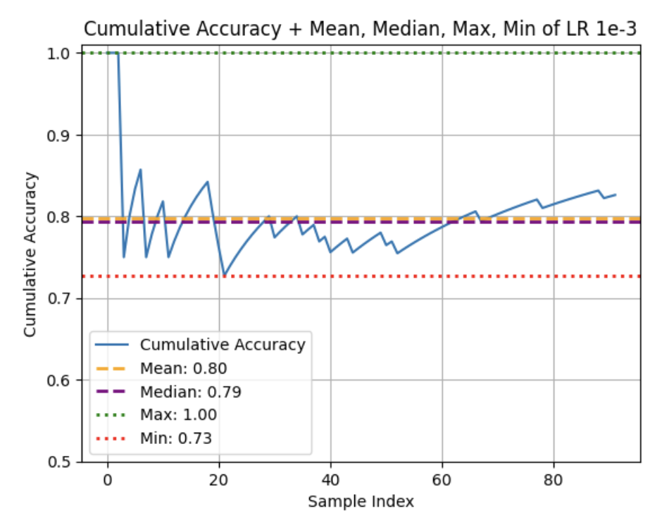
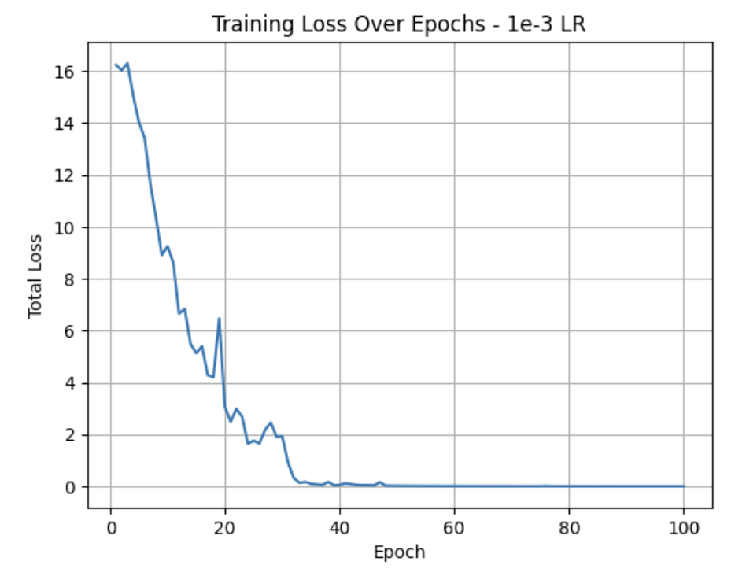
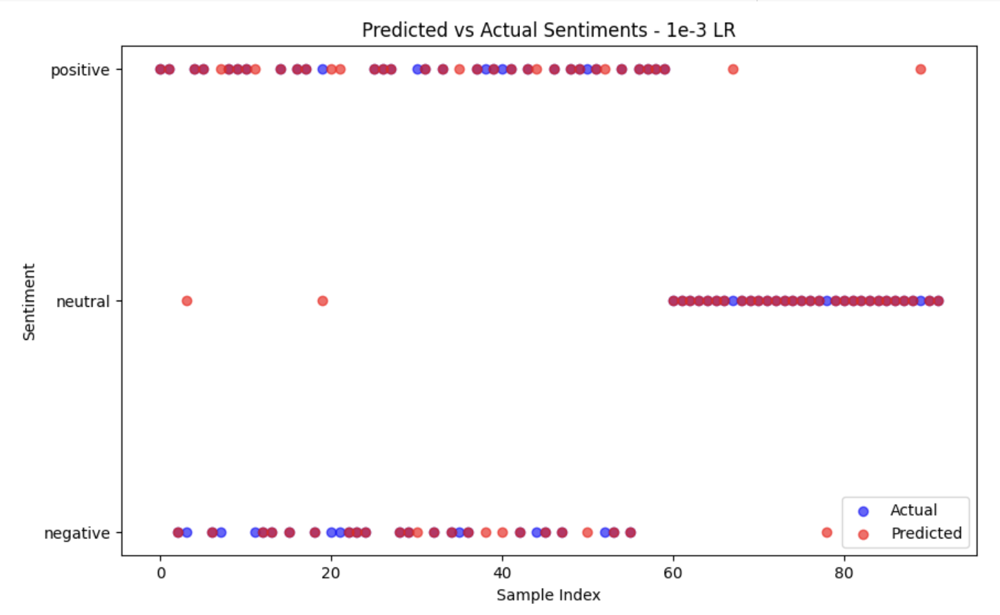
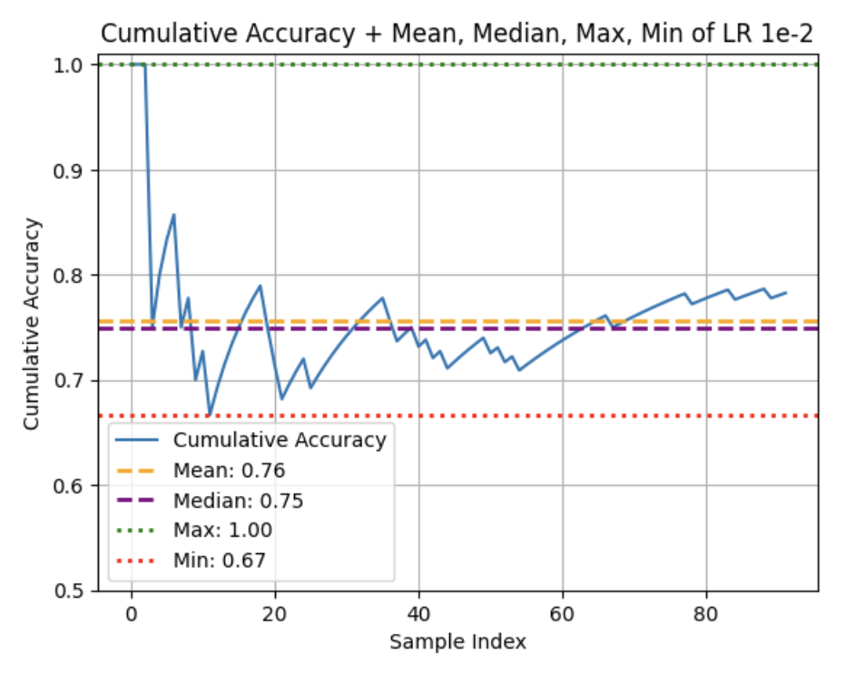
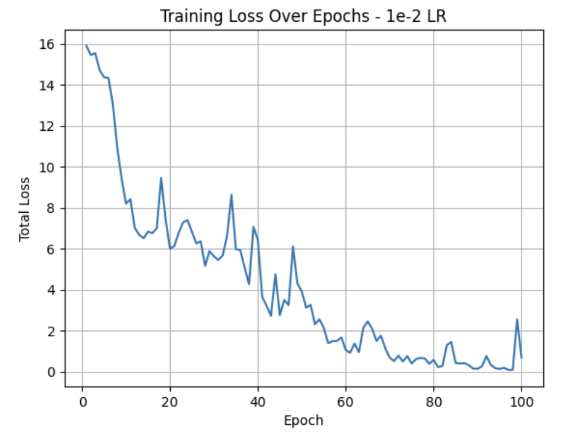
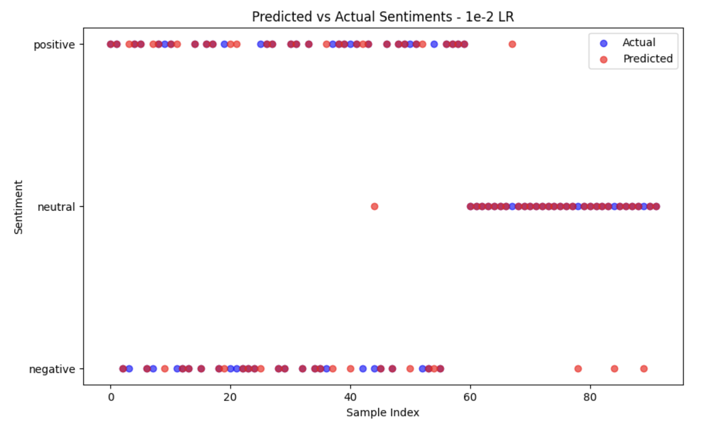
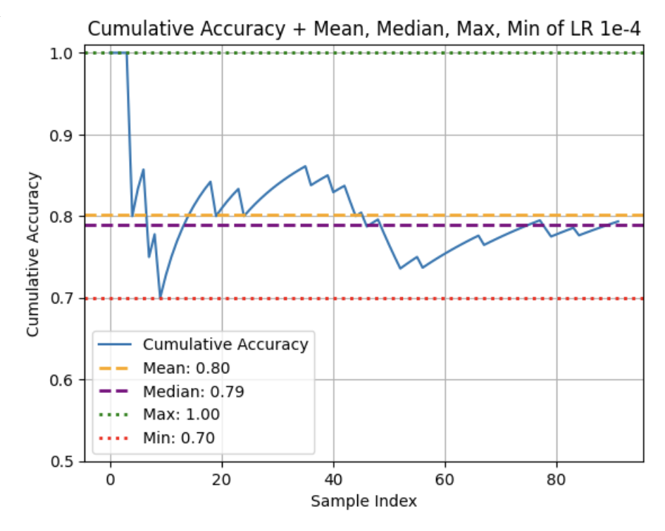
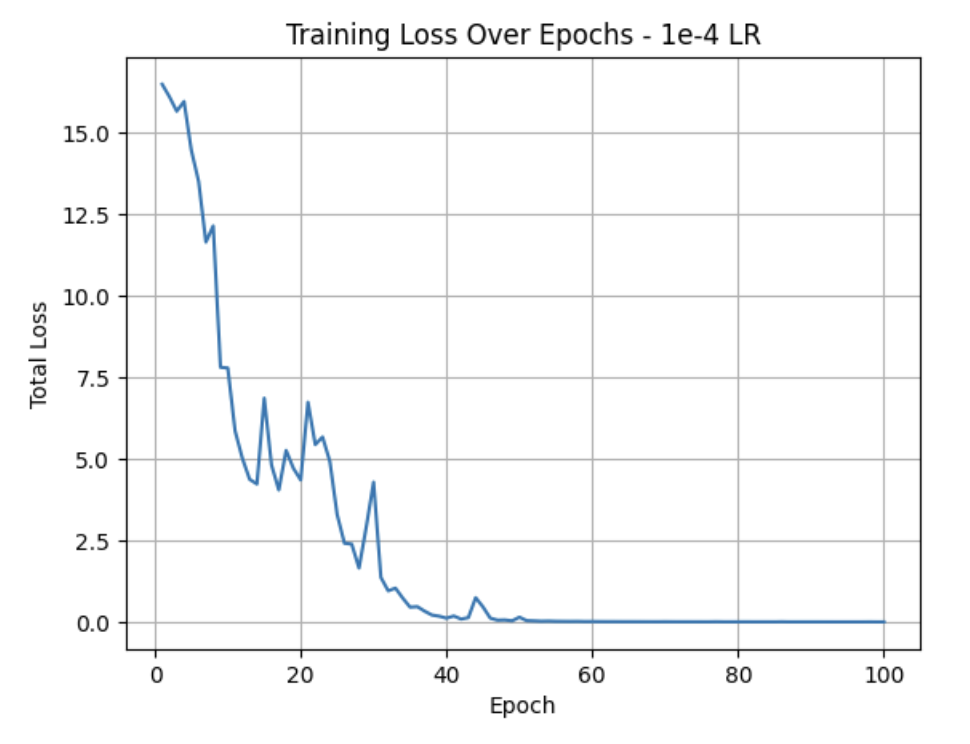
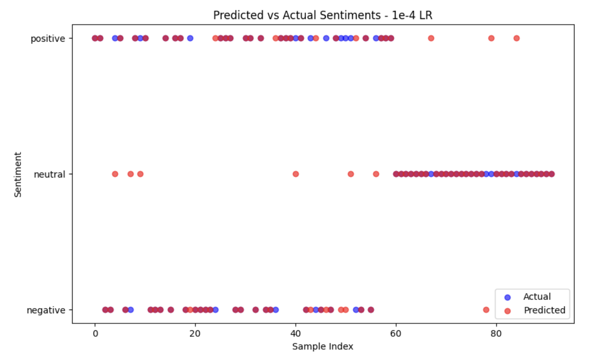

# sentiment-analyzer-from-scratch

## Description
This is a simple sentiment analysis model made entirely from numPy, re, and NLTK alone. During development, pandas and matplotlib were also used. The model uses self-made embeddings, positional encodings, custom transformer architecture, and logits. It employs several concepts from calculus and linear algebra to perform the forward and backward passes. 

The model was trained on 417 entries of [this dataset](https://www.kaggle.com/datasets/nursyahrina/chat-sentiment-dataset) from KaggleHub. It takes a test and classifies it to one of three sentiments - negative, neutral, or positive.

Given that this model was developed from scratch using limited samples, it is primitive and makes the best predictions from simple, straightforward sentences, similar to the ones you can see in the dataset.

## How it Works
[Will work on this later]

## Model Performance with Different Learning Rates

### Learning Rate of 1e-3 (`sentiment_analyzer_1.pkl`)
Within the 92 samples in the test dataset, this version had an average accuracy of 79.1%.




### Learning Rate of 1e-2 (`sentiment_analyzer_2.pkl`)
Within the 92 samples in the test dataset, this version had an average accuracy of 76.3%.




### Learning Rate of 1e-4 (`sentiment_analyzer_3.pkl`)
Within the 92 samples in the test dataset, this version had an average accuracy of 80.1%.




### Learning Rate of 2e-3 (`sentiment_analyzer_4.pkl`)
Within the 92 samples in the test dataset, this version had an average accuracy of 70.6%.


## Installation & Running the Model
Clone the repository:
```
https://github.com/addinar/sentiment-analyzer-from-scratch.git
```

After cloning the repository, simply follow the instructions in the demo notebook, saved as `notebooks/sentiment_analyzer_demo.ipynb`.

## License
Distributed under MIT License.
