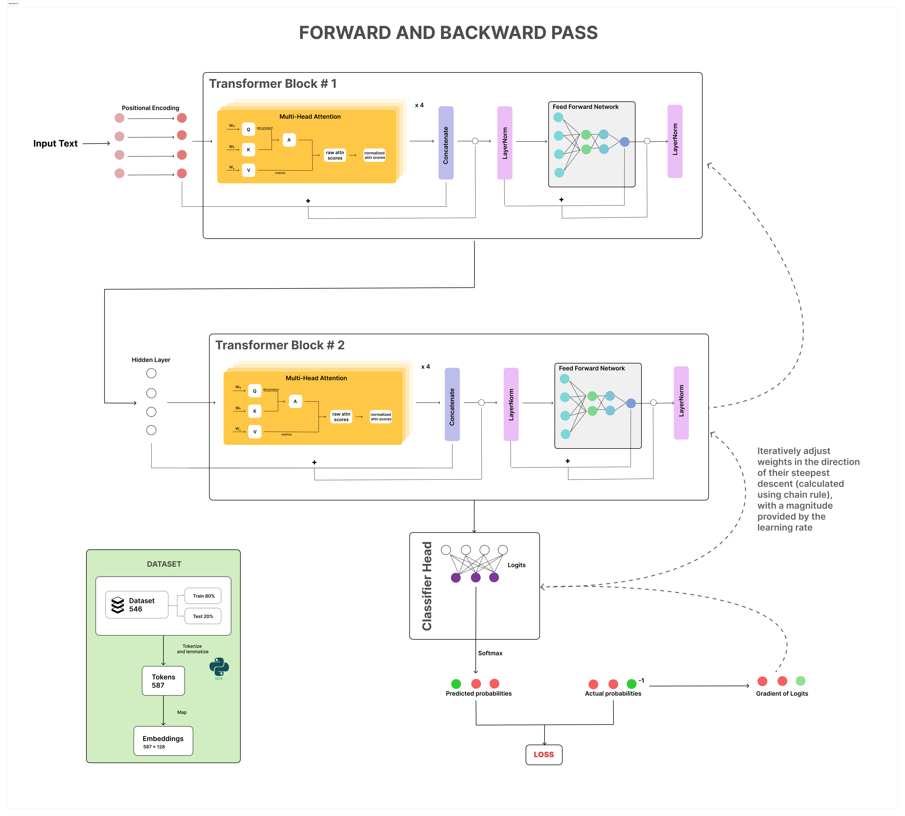

# sentiment-analyzer-from-scratch

## Description
This is a simple sentiment analysis model made almost entirely from numPy, with a little help from NLTK. During development and testing, pandas and matplotlib were also used. The model takes in an inputted text and classifies it to one of three sentiments: negative, neutral, or positive.

The model was trained on 452 samples of [this dataset](https://www.kaggle.com/datasets/nursyahrina/chat-sentiment-dataset) from KaggleHub, and tested with the remaining 92 samples. It uses jointly optimized embeddings and weights, positional encoding, custom transformer architecture, and logits. Several concepts from calculus and linear algebra were applied to execute the forward and backward passes. 

Given that this model was developed from scratch using limited samples, it is primitive and makes the best predictions from simple, straightforward sentences, similar to the ones you can see in the dataset.

## How it Works
The data was split into training and testing sets, then tokenized. Each token was further lemmatized then mapped to a unique 128-dimension embedding vector. An input sentence can be represented as an embedding matrix, and can subsequently be augmented with positional encoding. The model's architecture itself consists of two consecutive Transformer blocks, each equipped with four-headed self-attention mechanisms, feed-forward networks, and LayerNorm. The final hidden state was passed through a linear layer, which was then transformed into a probability distribution vector using softmax. The index with the highest probabibility is then mapped to its corresponding sentiment label.  




The main difference between my transformer encoder block and traditional encoders, is that I normalized concatenated attention scores right before applying them to the embedding and following through with LayerNorm, as a way to stabilize the scores among the heads. This technique has visibly outputted better final training losses and accuracy scores in testing samples.  

## Model Performance with Different Learning Rates

### Learning Rate of 1e-3 (`sentiment_analyzer_1.pkl`)
Within the 92 samples in the test dataset, this version had an average accuracy of 79.1%.


### Learning Rate of 1e-2 (`sentiment_analyzer_2.pkl`)
Within the 92 samples in the test dataset, this version had an average accuracy of 76.3%.


### Learning Rate of 1e-4 (`sentiment_analyzer_3.pkl`)
Within the 92 samples in the test dataset, this version had an average accuracy of 80.1%.


### Learning Rate of 2e-3 (`sentiment_analyzer_4.pkl`)
Within the 92 samples in the test dataset, this version had an average accuracy of 70.6%.


## Installation & Running the Model
Clone the repository:
```
https://github.com/addinar/sentiment-analyzer-from-scratch.git
```

After cloning the repository, simply follow the instructions in the demo notebook, saved as `notebooks/sentiment_analyzer_demo.ipynb`.

## License
Distributed under MIT License.
